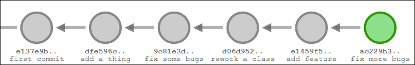
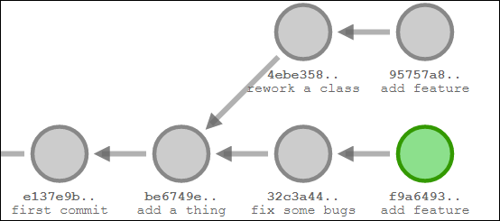
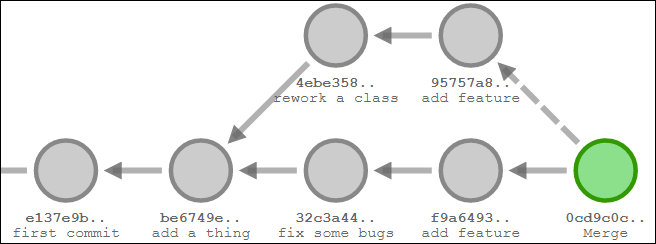

# Git and Command Line Interfaces

## Git

In a sentence: Git tracks all changes made to a codebase and allows for programming in a non-linear asynchronous way.



If you imagine a folder of code containing some program, you might work on it by yourself in a way very similar to the picture above. Suppose each circle represents a new state of the program, and the arrow points to the previous version that it is based on. You continually make changes or revisions of the code. This works perfectly fine when you're the only person working, but when you want to have two or even more people working on the same project, things will quickly break down.



You and your friend are working on a simple project, and you've got a shared Google Drive folder you upload your code to. You implement a basic feature first in "`add a thing`", and upload it to the folder. Your friend downloads that copy, and they think a class needs rewriting, so they move some code around, add a few methods, and rename some methods too. They decide to add a feature to that class too.

Meanwhile, you found some bugs in the class you just made and uploaded, so you fix the bugs. You decide to add a different feature to that same class.

Both you and your friend are done working for the night, so your friend uploads their work to the folder, and then you upload your work to the folder, and you message your friend that you've uploaded some more code to the folder.

The next morning, your friend wakes up and downloads your new code. However, when he opens it, the class he was working in yesterday seems totally unfamiliar.

With a Google Drive folder, or any folder on your computer, you probably know that trying to add a file with the same name as an existing file prompts you with a few options: replace the existing file, or cancel the operation. What could have happened in this situation is that when you uploaded your change to the file you worked on, you replaced your friend's file. However, since your friend renamed some methods, he changed some files you didn't change, which means half the files in your program now reference nonexistent methods.

Git fixes this issue by tracking changes within each file.

### Terminology

- Repository or Repo
  - A folder of code, including all its history
- Commit
  - A change made to the program
    - The change could span one file or many files
  - A specific state of the program at some point in time
    - Each circle in the diagrams would each be one commit
- Local repository
  - The git repo (files+history) you have on your own computer
  - Like a folder of code you have on your computer
- Remote repository
  - The git repo you eventually want to send all your changes to
  - Like the Google Drive folder you have, to share your changes with your friend
- Push
  - Sending commits you made on your local repository to the remote repository
- Pull
  - Getting new commits made on the remote repository onto your local repository
- Merge
  - Merging (wow, really?) two commits into a single one.
    - The merging is just a conceptual thing, where you create a new circle on the diagram, with arrows pointing to two other circles. In fact, a merge can consist of deleting all changes made in one commit and only keeping changes made on the other. Here's what a merge would look like on the previous example:



- Merge conflict
  - When git is not able to automatically perform a merge, caused by changes made to the same parts of a file, like two people modifying the same line. Someone has to manually look at the conflict and decide whether they want to keep the change from one commit or the other, or write something completely new.
- Upstream repository
  - A repository that you clone or track data from (e.g. changes from that repo flows downstream to you)
  - Example: for these lessons, you "fork" this repository, which creates a remote repository on your account, with my repository as the upstream repository. You then create a local repository on your own computer.
    - The data (commits) flows from my repo (the upstream repo) to your fork, and your fork = your remote repo, and changes to your remote repo pulled to your local (your computer) repo.
- There is also a concept called a branch which is fairly important, but I don't want to introduce too many things at once especially since we won't really need to use branches. These are the absolute basics (with the exception of upstream, I just threw it in because you're forking this repo so you might as well know about it).

By tracking changes within files, git is able to merge together revisions that affect one file independently (e.g. you and your friend each add independent methods to a single class) with no intervention, and is able to notice when you make a change that conflicts with another change someone else made.

[Time for a short demo on the process of committing, pushing, and pulling.](http://git-school.github.io/visualizing-git/#free-remote) Basically, you write code, commit it to your local repo, and push it to your remote, and others can pull the change on remote to their own local repo.

This process can occur over a long period of time too: you might be working on a 2 month old copy of the remote repo, and you can commit to your 2 month old local repo, but when you try to push, git will force you to pull all 2 months of changes and merge the remote's latest commit with your local latest commit before pushing.

## CLIs

Follow along: open a terminal. If you're on Windows, you can search for and open `powershell`, or if you saw the links I posted last week, [WSL](https://docs.microsoft.com/en-us/windows/wsl/install-win10) or maybe you'll open something but within the [Windows Terminal](https://aka.ms/terminal) application instead of the usual one. If you're on linux you probably know how to open a terminal. Yes, cmd exists: just replace `ls` with `dir` if you really want to use cmd.

You'll likely be greeted by something like:

```text
beepboop@TOASTER:~$

PS C:\Users\beepboop>
```

The first is what bash on Ubuntu gives me and second is powershell. Bash indicates the user I'm logged in to (beepboop) and the name of my computer (TOASTER). Powershell lists the file path to my users folder.

Unlike powershell, bash has `:~$` at the end of the line. `~` is actually an alias for the path `/home/beepboop` (your home folder, equivalent to the Users folder on Windows).

This directory path is very important. It is the **current working directory** or **working directory** of the terminal. Being in the right working directory will save lots of time.

### File and Directory Paths

Before I can continue, I need to go over paths. There are two types of paths: relative and absolute.

- Absolute Paths
  - Examples: `/usr/bin/python`, `C:\Program Files\Java\jdk1.8.0_161\bin\java.exe`
  - A complete file path that starts from
    - The topmost directory (the root directory) on Linux: `/` or Windows: `/` and `\`
      - I have learned today while writing this that `\Users\beepboop\Desktop` is a valid Windows path
    - A drive letter on Windows: `C:\`, `D:\`, etc
  - and specifies every single folder along the way until the target file/folder is reached
    - Each new folder is separated by either `/` or `\` depending on OS
      - Fortunately, Windows accepts forward slashes in the command line so I'll continue with those but just assume you could replace all the `/` with `\` (and even mix and match)
- Relative Paths
  - Examples: `asdf.png`, `images/asdf.png`, `./images/funny/asdf.png`, `../../text files/asdf.txt`
  - A file path that does not
    - Start with `/` indicating the root directory
    - Include a drive letter on Windows
  - How are they evaluated? They are evaluated taking into consideration the current working directory. For these examples, assume the working directory is `C:/Users/beepboop/Desktop`
    - If the path starts with a name, like `asdf.png` or `images/asdf.png`, it is equivalent to `./asdf.png` or `./images/asdf.png`
    - The character `.` means "the current working directory"
      - `.` means `C:/Users/beepboop/Desktop`
      - `./asdf.png` means `C:/Users/beepboop/Desktop/asdf.png`
      - `./images/asdf.png` means `C:/Users/beepboop/Desktop/images/asdf.png`
    - The character `..` means "go up one directory" or "the parent directory of the current working directory"
      - `..` means `C:/Users/beepboop`
      - `../..` means `C:/Users`
      - `../Downloads/images/asdf.png` means `C:/Users/beepboop/Downloads/images/asdf.png`

Why does being in the right working directory help? Imagine you were using a command line program to read some files. If all your files are in `C:/Users/beepboop/Desktop/files/school stuff/grade 12/comp sci/unit 1/hello.txt` and you're in the default directory of `C:/Users/beepboop`, when you run a program in the command line, the program will inherit the same working directory, `C:/Users/beepboop`.

That means any time the program tries to open a file, the path of the file with be determined with the working directory `C:/Users/beepboop`. If you want to pass it `hello.txt`, you'd need to specify `Desktop/files/school stuff/grade 12/comp sci/uni 1/hello.txt` or worse, the full absolute path. However, if your working directory is `C:/Users/beepboop/Desktop/files/school stuff/grade 12/comp sci/unit 1`, all you need to give the program is `hello.txt`.

You can run commands by writing the name of the command, and hitting enter. However, you'll often need to specify certain arguments. Running command line programs is essentially like calling a function. If the command requires arguments, you write the command name, a space, and any arguments (all space-separated).

The most basic command is to change the working directory, shortened to `cd`. `cd` sets your working directory to be whatever path you give it. However, you can use relative or absolute paths to easily traverse folders. Notice the usage is to write the name `cd`, a space, and the path to go to.

```text
PS C:\Users\beepboop> cd C:/
PS C:\> cd Users
PS C:\Users> cd ./beepboop
PS C:\Users\beepboop> cd ../..
PS C:\> cd C:/Users/beepboop/Desktop
PS C:\Users\beepboop\Desktop> cd ..
PS C:\Users\beepboop>
```

Typing path names like that is hard, so if you type out a few characters and then hit `Tab`, your terminal should try to autocomplete a directory or file.

Next: `ls`. `ls` just lists out files in the given directory, or the current directory if no argument is given.

In Python, functions can use positional (ordered) arguments, and also keyword arguments: `func(arg1, arg2, arg3, key1=1, key2=2, key3=3)`. On the command line, you have positional arguments too, as well as options, which are like keyword arguments.

Here's an example command:

`asdf -hb -m "hello" asdf.png`

- `asdf` is the name of the command
- `-hb` is equivalent to `-h -b`, and these are two options that take no arguments (they are like a boolean flag, indicating `true` or `false`)
- `-m "hello"` is specifying an option named `m` with the value `"hello"`
- `asdf.png` is a positional argument

Though a program can technically parse the arguments however they want, in general, options like `-m` only use the next argument as a value, so the program isn't passing `"hello"` and `asdf.png` to the argument `-m`. Often the options appear before the positional argument.

You can also specify `"hello"` by just writing `hello`. However, by putting it in quotation marks you are free to use characters like spaces.

When you call functions in programming, you need to know the arguments (e.g., how would I know to provide an option named `m`? How would I know what ths positional argument should be?), and to get the arguments you need, you check documentation. Fortunately, to help you determine the arguments to use, pretty much every decent program includes help.

In general, you can try writing `command --help` or `command -h` (`-h` is less likely since that could stand for something the program actually uses). On linux you can try `man command` (`man` for manual) and on powershell you can try `Get-Help command`. Some Windows programs (or maybe more?) use `command -?`.

In general (this whole section is just in general over and over again), when reading help, the characters `[]` refer to something being optional. The character `|` refers to a choice between one option or the other, and the characters `...` refer to one or more of whatever was listed.

In general, a single hyphen refers to a short form name of an argument, while two refers to the full name.

In addition to commands that you can specify by name, you can run any executable by writing the path to the executable file as the command name, then space separated arguments like usual.

You can use a relative or absolute path, however there is one exception. You can use any path, except for just the name of the executable by itself (i.e. running it from the directory that the executable is in). You must write `./filename` instead of `filename` to run the executable.

## Environment Variables

Environment variables are just string variables stored at the OS level. In Windows, there are system variables, user variables, and process variables.

When you set a system environment variable, every process (program) launched will be able to access that variable. In Python, you can use `os.getenv` from the `os` standard library module, and in command lines you can do `echo $VARIABLE_NAME` on linux and `echo $Env:VARIABLE_NAME` on powershell, and `echo %VARIABLE_NAME%` on cmd.

When you set a user variable, every process launched as that user will be able to access that variable in the same ways.

When you set a process variable, only the process which set the variable and all child processes of that process can access the variable (in the same ways as above). You can try this by opening powershell and writing:

```text
PS > $Env:EXAMPLE_VAR = "hello"
PS > start powershell
```

A new window of powershell will launch and if you run `echo $Env:EXAMPLE_VAR` it will print `hello`. However, if you launch powershell through some other method, nothing will be printed.

The most important environment variable is probably the `PATH` variable. The `PATH` variable is the only reason why you can type commands by name and not by specifying the full path of the executable.

When you type a command like `python` or `ls`, the way that the OS determines what executable file to run without you specifying the full path is that it looks at the value of the `PATH` system variable. The `PATH` variable contains a list of absolute directory paths, and the OS will search through each directory specified by `PATH` (in the order that the folders are specified), and once it finds a directory containing an executable file with the name requested, it is run.

On Windows, often programs like Java and Python modify the system `PATH` variable to add the install directories of the program, so that you can use commands `java` and `python`. However, if they somehow didn't modify the `PATH`, or if you want to be able to run some other program from anywhere, you can modify the `PATH` variable yourself. On Linux, many packages you install will add an executable to a folder that is specified in the path instead of adding a new folder path to the `PATH`.

## Exercises

1. Create a [GitHub](https://github.com/) account.

2. Fork [this repository](https://github.com/beepboop271/computer-science-club), and clone your fork using `git`, [Github Desktop](https://desktop.github.com/), or any other similar method (don't download as zip, because then every time I update this repository, you won't be able to sync my changes unless you re-download the zip again).

3. If you don't already have it, install [Python](https://www.python.org/downloads/) (version 3.6 or greater).

4. If you're on Windows, I recommend installing [Windows Terminal](https://aka.ms/terminal) (yes, I know, ew Microsoft store, but it's made by Microsoft so why wouldn't they put it there). In addition, optionally install [WSL](https://docs.microsoft.com/en-us/windows/wsl/install-win10) for Linux on Windows (note: I use WSL 1, but I'm not too sure what WSL 2 is like). If you're on Mac or Linux, just open your terminal.

5. Run `python --version` to check what version of Python is set to `python` (you may also try `python3`, or maybe `python3.6` or `python3.8` on linux). If it does not print a version you expect, ask me about it (not sure if I will have enough time to explain this for week 1).

6. Without modifying `01-activity1.py`, print out the value of `s` after the program runs (use IDLE or interactive mode in the command line).

7. Get the program `01-activity2.py` to print the line starting with "good job", and determine the number printed on the same line.
